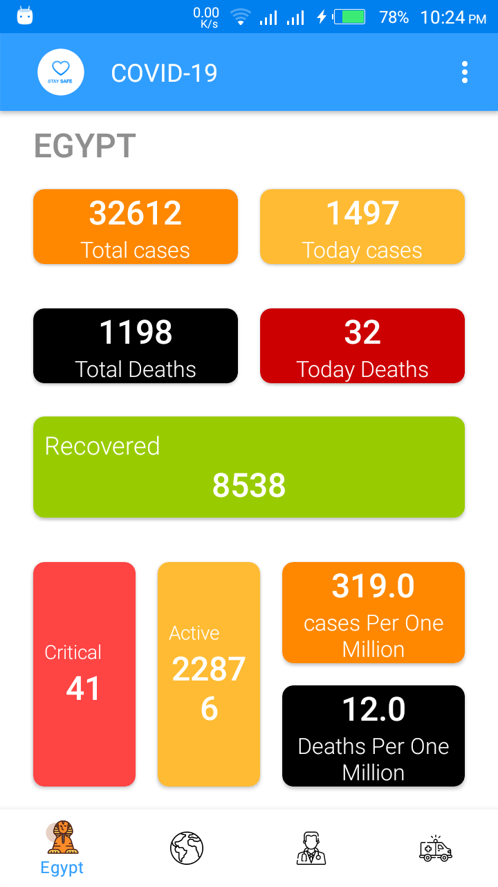
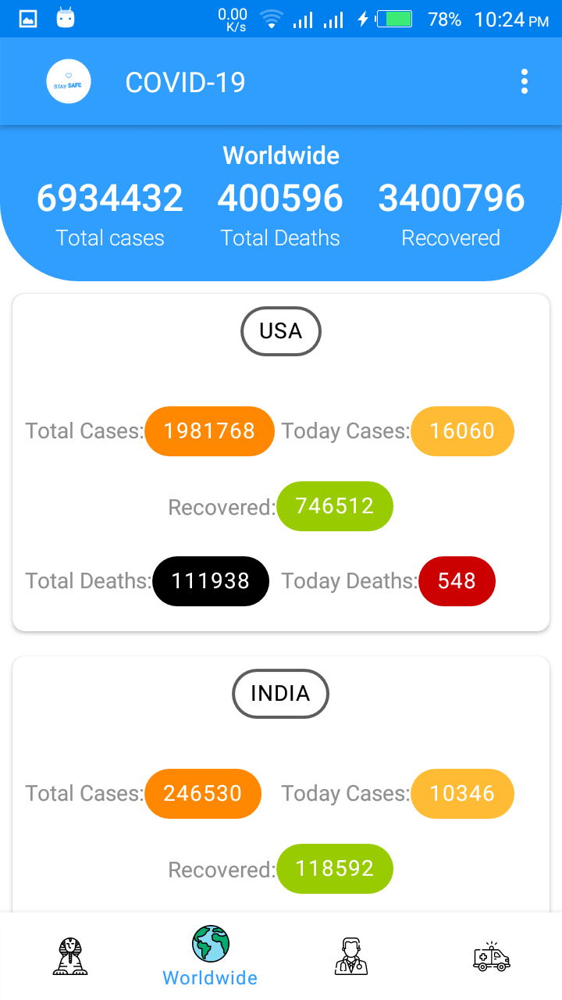
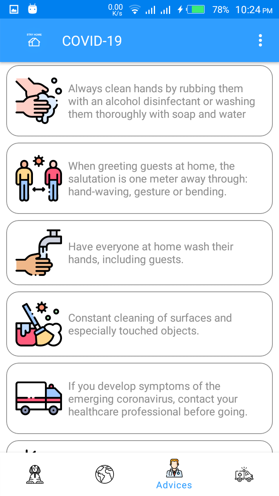
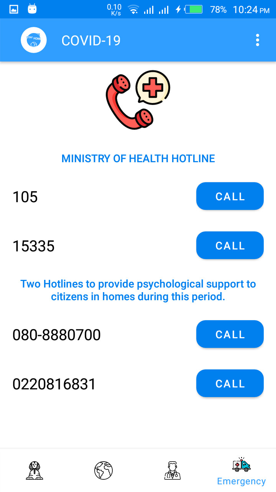

# COVID19

### This is a Non-Commercial project that:
- Gets current cases of Egypt.
- Gets the current worldwide cases and the cases of each country.
- Shows some advices about the virus and it's symptoms.
- Shows the official hotlines of the Egyption Ministry of health.

      

also, i handled errors such as network errors or server error and asked the permissions as [best practices guidlines](https://developer.android.com/training/permissions/usage-notes)

## APIs used
- [Novel Covid API](https://github.com/NovelCOVID/API)

## 3rd party libraries used
- [Retrofit](https://square.github.io/retrofit/)
- [MVVM](https://developer.android.com/topic/libraries/architecture/viewmodel.html#sharing)
- [Navigation component](https://developer.android.com/guide/navigation)
- [Lottie](http://airbnb.io/lottie/#/android)
- [MDC](https://material.io/components)

## Feedback
- [mohamed.emad222210@gmail.com](mailto:mohamed.emad222210@gmail.com)
